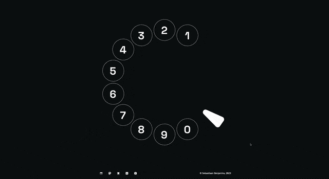

# [benjami.in](https://benjami.in/)

My personal portfolio showing my UX and design projects/skills. The development of the website itself shows my development skills.

## Stack

-   Site generator: [Astro](https://astro.build/)
-   Interactive framework: [Svelte](https://docs.astro.build/en/guides/integrations-guide/svelte/)
-   Deployment: [Netlify](https://netlify.com/)
-   Styling: [SCSS](https://sass-lang.com/documentation/syntax)
-   Icons: [Phosphor Icons](https://phosphoricons.com/)
-   CMS: [Sanity](https://www.sanity.io/)

## Development

| Command             | Action                                           |
| :------------------ | :----------------------------------------------- |
| `yarn`              | Installs dependencies                            |
| `yarn dev`          | Starts local dev server at `localhost:3000`      |
| `yarn build`        | Builds production site to `./dist/`              |
| `yarn astro ...`    | Run CLI commands like `astro add`, `astro check` |
| `yarn astro --help` | Get help using the Astro CLI                     |
