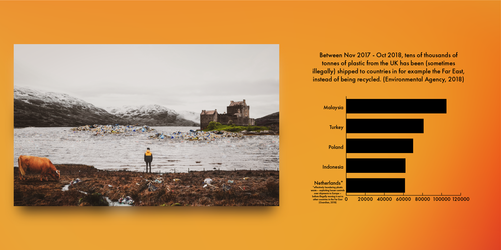

_The artwork created. It shows a Scottish loch polluted by rubbish from other countries_

---

I also designed a social media post to accompany the artwork to show some interesting facts about how much plastic the UK has exported to other countries. It was for example very surprising to me, as someone from The Netherlands, that the UK has shipped a lot of plastic to The Netherlands to then illegally be shipped to countries in the Far East, exploiting looser controls over shipments to Europe.

_The artwork created together with statistics on how much rubbish is moved from the UK to other countries_

View the post on Instagram:
[instagram.com/p/CM2RxgpBKBv](instagram.com/p/CM2RxgpBKBv)
